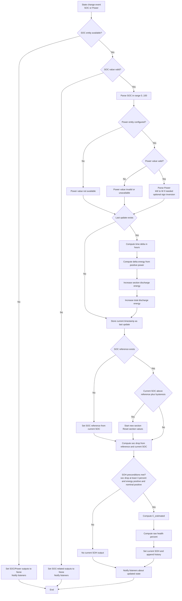
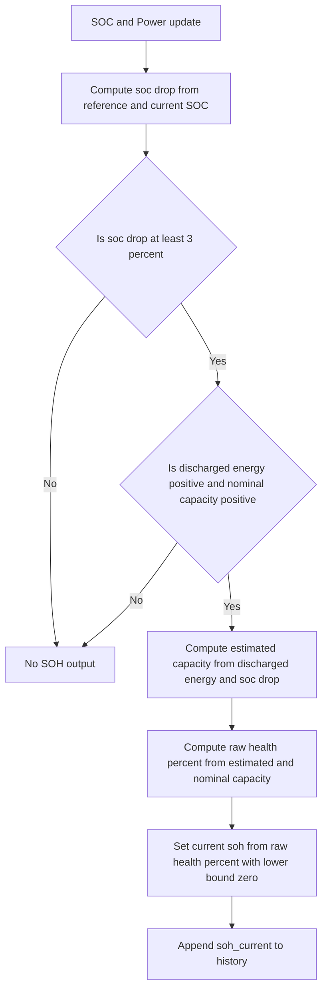
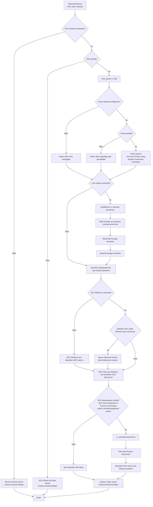
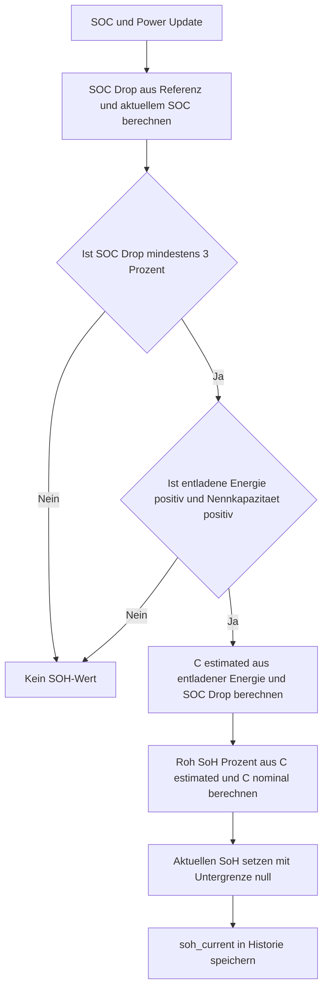

# BatteryHealth Sensor

English first, German second.

## EN

### Overview

This integration estimates battery SoH (State of Health) from SOC trend and power.
Setup is config-flow-only in Home Assistant.

### Setup

1. Home Assistant -> Settings -> Devices & Services -> Add Integration.
2. Select BatteryHealth Sensor.
3. Fill in:
  - name
  - soc_entity (battery SOC sensor, 0..100 %)
  - power_entity (power sensor)
  - nominal_capacity_kwh (nominal battery capacity)
  - invert_power_sign (enable only if discharge is reported as negative)

### Calculation Logic

1. Integrate discharge energy from positive power:
  - delta_hours = (now - last_update).seconds / 3600
  - discharge_power_w = max(power_value, 0)
  - delta_energy_kwh = (discharge_power_w / 1000) * delta_hours
2. Update energy counters:
  - discharged_energy_kwh += delta_energy_kwh
  - discharged_energy_total_kwh += delta_energy_kwh
3. Manage SOC reference:
  - first valid SOC sets soc_reference
  - if soc_value > soc_reference + 0.3, reset section values
4. Compute SOH only when:
  - soc_drop >= 3.0
  - discharged_energy_kwh > 0
  - nominal_capacity_kwh > 0
5. Formulas:
  - soc_drop = soc_reference - soc_value
  - estimated_capacity_kwh = discharged_energy_kwh / (soc_drop / 100)
  - raw_health_percent = (estimated_capacity_kwh / nominal_capacity_kwh) * 100
  - soh_current = round(max(0, raw_health_percent), 2)
  - soh_average = mean(soh_history)
  - full_charge_cycles = discharged_energy_total_kwh / nominal_capacity_kwh

### Full Flowchart

### Simplified SOH Flowchart

### Entities Created

Per config entry, these sensor entities are created:

- SOH Current (%)
- SOH Average (%)
- C Estimated (kWh)
- C Nominal (kWh)
- Discharged Energy (kWh, section-based)
- Discharged Energy Total (kWh, cumulative)
- Full Charge Cycles
- SOC Reference (%)
- SOC Drop (%)
- SOC Current (%)
- Power Current (W)
- SOH Raw (%)
- SOH Measurements (count)
- Calculation Ready (0 or 1)

### Notes

- Discharge should be positive power. Otherwise enable invert_power_sign.
- If SOC or Power is temporarily unavailable, calculation pauses until valid states return.
- SOH is section-based and requires at least 3 % SOC drop.

## DE

### Ueberblick

Diese Integration schaetzt den Batterie-SoH (State of Health) aus SOC-Verlauf und Leistung.
Die Einrichtung erfolgt ausschliesslich ueber den Config Flow.

### Einrichtung

1. Home Assistant -> Einstellungen -> Geraete & Dienste -> Integration hinzufuegen.
2. BatteryHealth Sensor waehlen.
3. Folgende Felder ausfuellen:
  - name
  - soc_entity (Batterie-SOC-Sensor, 0..100 %)
  - power_entity (Leistungssensor)
  - nominal_capacity_kwh (Nennkapazitaet)
  - invert_power_sign (nur aktivieren, wenn Entladung negativ geliefert wird)

### Berechnungslogik

1. Entladeenergie wird aus positiver Leistung integriert:
  - delta_hours = (now - last_update).seconds / 3600
  - discharge_power_w = max(power_value, 0)
  - delta_energy_kwh = (discharge_power_w / 1000) * delta_hours
2. Energiezaehler werden aktualisiert:
  - discharged_energy_kwh += delta_energy_kwh
  - discharged_energy_total_kwh += delta_energy_kwh
3. SOC-Referenz wird verwaltet:
  - erste gueltige SOC-Messung setzt soc_reference
  - bei soc_value > soc_reference + 0.3 startet ein neuer Abschnitt
4. SOH wird nur berechnet, wenn:
  - soc_drop >= 3.0
  - discharged_energy_kwh > 0
  - nominal_capacity_kwh > 0
5. Formeln:
  - soc_drop = soc_reference - soc_value
  - estimated_capacity_kwh = discharged_energy_kwh / (soc_drop / 100)
  - raw_health_percent = (estimated_capacity_kwh / nominal_capacity_kwh) * 100
  - soh_current = round(max(0, raw_health_percent), 2)
  - soh_average = mean(soh_history)
  - full_charge_cycles = discharged_energy_total_kwh / nominal_capacity_kwh

### Vollstaendiger Ablauf

### Vereinfachter SOH-Ablauf

### Erzeugte Entitaeten

Pro Config Entry werden diese Sensoren erstellt:

- SOH Current (%)
- SOH Average (%)
- C Estimated (kWh)
- C Nominal (kWh)
- Discharged Energy (kWh, abschnittsbezogen)
- Discharged Energy Total (kWh, kumulativ)
- Full Charge Cycles
- SOC Reference (%)
- SOC Drop (%)
- SOC Current (%)
- Power Current (W)
- SOH Raw (%)
- SOH Measurements (Anzahl)
- Calculation Ready (0 oder 1)

### Hinweise

- Entladung sollte als positive Leistung vorliegen. Sonst invert_power_sign aktivieren.
- Wenn SOC oder Leistung kurz unavailable ist, pausiert die Berechnung bis wieder gueltige Werte vorliegen.
- Die SOH-Berechnung ist abschnittsbasiert und braucht mindestens 3 % SOC-Abfall.
